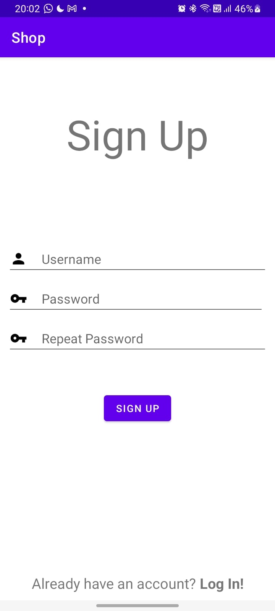
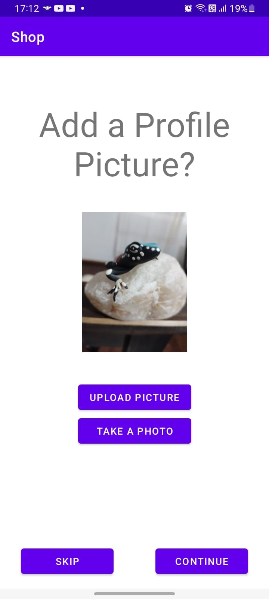
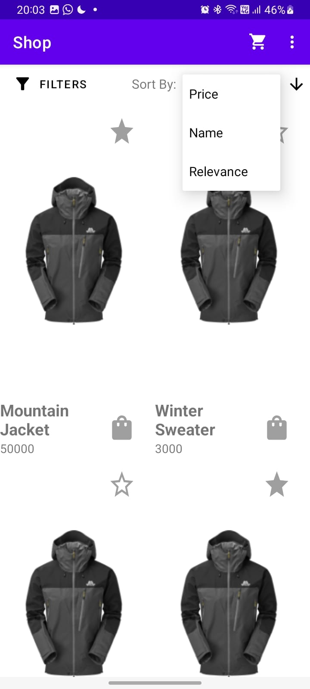
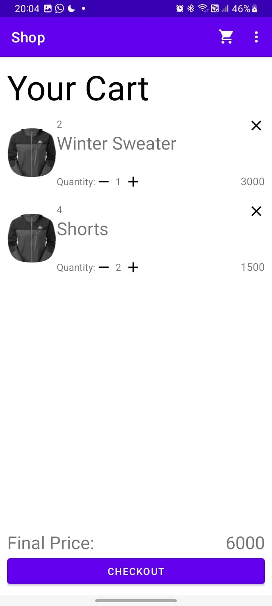
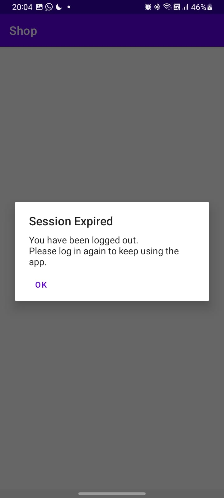

# SHOP

Esta aplicación fue mi último proyecto durante mi pasantía en Globant.

## Objetivo

Shop emula parcialemente una tienda online pero de manera completamente offline. 
Como producto terminado no tiene una utilidad real pero durante su desarrollo me ayudó para avanzar enormente con mis conocimientos y confianza en lo que respecta al desarrollo de aplicaciones en Android con Kotlin y ahora queda como registro de ese progreso.

## Capturas

## Características

* **Clean Arquitechture + MVVM**: La aplicación está estructurada usando el patrón de diseño Clean Arquitechture, que ayuda a separar la aplicación en capas distintas con responsabilidades bien definidas. Esto hace que el código sea más mantenible y fácil de entender. La aplicación también está implementada usando el patrón Model-View-Viewmodel (MVVM), que separa aún más la capa de presentación de la lógica de negocio. Esto ayuda a mejorar la reutilización y testeabilidad del código.

* **Persistencia de datos con Room Database y DataStore**: La aplicación utiliza Room, una biblioteca de base de datos, para persistir datos localmente en una base de datos SQLite. Esto permite que la aplicación almacene y recupere datos incluso cuando el dispositivo está sin conexión. La aplicación también utiliza DataStore, un sistema de almacenamiento de clave-valor, para guardar y recuperar pequeñas cantidades de datos. DataStore es una alternativa a SharedPreferences y permite más flexibilidad y mejor rendimiento.

* **Inyección de dependencias con Dagger Hilt**: Dagger Hilt se utiliza para realizar la inyección de dependencias, lo que facilita la prueba y el mantenimiento del código. La inyección de dependencias ayuda a desacoplar las diferentes partes de la aplicación y hace más fácil intercambiar implementaciones para pruebas u otros propósitos.

* **Actividades + XML**: Decidí utilizar XML en lugar de Compose porque es el sistema que se utiliza actualmente en la mayoría de las aplicaciones Android. Además, XML ofrece una alta grado de personalización y es fácil de modificar y mantener. Aunque Compose es una herramienta más moderna y potente, aún se encuentra en fase de desarrollo y no es tan ampliamente utilizada. 

* **RecyclerViews**: La aplicación utiliza RecyclerViews para mostrar listas de datos de manera eficiente. Los RecyclerViews son más eficientes que los ListViews porque solo inflan el número necesario de titulares de vista necesarios para mostrar los datos en pantalla, en lugar de inflar todas las vistas de la lista de antemano. Esto ayuda a mejorar el rendimiento y suavidad de la aplicación.

* **Unit Tests**: La aplicación incluye pruebas unitarias para verificar la corrección de los componentes individuales del código base. Estas pruebas ayudan a asegurar que la aplicación funcione como se pretende y pueden alertar a los desarrolladores sobre cualquier problema que pueda surgir. Al ejecutar estas pruebas de forma regular, los desarrolladores pueden detectar y solucionar problemas desde etapas tempranas, mejorando así la calidad y estabilidad de la aplicación.

